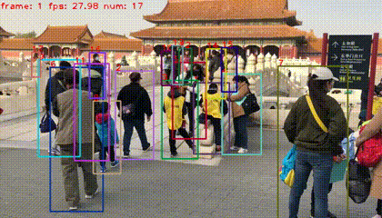

# Human-Only ByteTrack with DIoU Matching

This repository is a customized ByteTrack + YOLOX pipeline for multi-human tracking in videos.

The project starts from COCO-pretrained YOLOX weights, then fine-tunes the detector for pedestrian-only tracking using MOT20-style annotations. On the tracking side, the original ByteTrack association has been enhanced with DIoU-based matching, confidence-aware matching, and adaptive track buffering to improve identity consistency under crowding and occlusion.

## What is different in this project

- Human-focused detector:
  - `num_classes = 1` in the custom experiments.
  - Training/evaluation data is prepared with pedestrian-only annotations.
  - `tools/demo_track_human.py` filters detections to `person` by default.
- COCO pretrained initialization:
  - Base weights in [pretrained/yolox_x.pth](pretrained/yolox_x.pth).
- MOT20 fine-tuning:
  - Main experiment file: [exps/example/mot/yolox_x_mix_mot20_ch.py](exps/example/mot/yolox_x_mix_mot20_ch.py)
  - Alternate human-only experiment: [exps/example/mot/yolox_x_ch.py](exps/example/mot/yolox_x_ch.py)
- DIoU tracking association:
  - Added in [yolox/tracker/matching.py](yolox/tracker/matching.py)
  - Used by the enhanced tracker in [yolox/tracker/enhanced_byte_tracker.py](yolox/tracker/enhanced_byte_tracker.py)
- Extra low-cost tracking improvements:
  - confidence-aware matching
  - adaptive track buffer
  - optional occlusion-aware state and ReID hooks in the enhanced tracker
- Human-only demo pipeline:
  - [tools/demo_track_human.py](tools/demo_track_human.py)

## Project structure

- `tools/train.py`: training entrypoint
- `tools/track.py`: MOT-style evaluation / tracking
- `tools/demo_track_human.py`: video, webcam, or image demo for person tracking
- `tools/convert_mot20_to_coco.py`: convert MOT20 to COCO-style annotations
- `tools/mix_data_test_mot20.py`: build the mixed MOT20 + CrowdHuman training json
- `exps/example/mot/yolox_x_mix_mot20_ch.py`: main human-only MOT20 mixed-data experiment
- `videos/palace.mp4`: sample input video
- `YOLOX_outputs/.../palace_tracked.mp4`: saved output videos

## Environment setup

Install dependencies:

```bash
pip install -r requirements.txt
python setup.py develop
```

Recommended:

- Python with PyTorch + TorchVision installed
- CUDA-enabled environment if you want training or fast inference

## Dataset preparation

This repo expects MOT-style data under `datasets/`.

### 1. Convert MOT20 annotations

```bash
python tools/convert_mot20_to_coco.py
```

This creates COCO-style annotation files under:

- `datasets/MOT20/annotations/train.json`
- `datasets/MOT20/annotations/val_half.json`
- `datasets/MOT20/annotations/train_half.json`
- `datasets/MOT20/annotations/test.json`

The converter keeps pedestrian annotations and filters non-person / ignored categories.

### 2. Prepare the mixed training set

The experiment `yolox_x_mix_mot20_ch.py` expects data under `datasets/mix_mot20_ch/`.

Create the mixed annotation file:

```bash
python tools/mix_data_test_mot20.py
```

This script combines:

- MOT20 training data
- CrowdHuman train
- CrowdHuman val

into:

- `datasets/mix_mot20_ch/annotations/train.json`

## Training

Fine-tune the human-only detector from the COCO-pretrained YOLOX-X weights:

```bash
python tools/train.py -f exps/example/mot/yolox_x_mix_mot20_ch.py -d 1 -b 4 -c pretrained/yolox_x.pth
```

Notes:

- Adjust `-d` and `-b` for your GPU setup.
- The experiment is configured for `num_classes = 1`.
- The main training recipe uses `mix_mot20_ch` as the training dataset and MOT20 as evaluation data.

## Evaluation and tracking

Run MOT-style tracking/evaluation with a fine-tuned checkpoint:

```bash
python tools/track.py -f exps/example/mot/yolox_x_mix_mot20_ch.py -c path/to/best_ckpt.pth.tar --mot20 --fp16
```

Tracked result text files are written to:

- `YOLOX_outputs/<experiment_name>/track_results/`

## Human-only video demo

Run the customized human tracker on a video:

```bash
python tools/demo_track_human.py video -f exps/example/mot/yolox_x_mix_mot20_ch.py -c path/to/best_ckpt.pth.tar --path videos/palace.mp4 --fp16 --fuse --save_result
```

Useful options:

- `--person_only`: person tracking only (default behavior)
- `--classes 0`: explicit person-only class filter
- `--no_diou`: disable DIoU and fall back from the enhanced association behavior
- `--save_metrics`: save per-frame tracking metrics
- `--save_graphs`: save graphs generated from tracking metrics

## DIoU matching

Original ByteTrack uses IoU-based cost for association. That works well when the predicted track box and the detection box still overlap from one frame to the next. But for fast-moving humans, sudden motion, or low frame-rate scenes, the object can shift so much that two correct boxes may have very small overlap or even no overlap at all. In that case, pure IoU becomes a weak matching signal and can cause the tracker to connect a track to the wrong person, which increases identity switches.

In this repo:

- `iou_distance(...)` remains available
- `diou_distance(...)` is added and used by the enhanced tracker

The DIoU score is:

```text
DIoU = IoU - (rho^2(b, b_gt) / c^2)
```

where:

- `IoU` is the intersection-over-union between the two boxes
- `rho^2(b, b_gt)` is the squared Euclidean distance between the centers of the two boxes
- `c^2` is the squared diagonal length of the smallest enclosing box covering both boxes

In this project, association cost is computed from DIoU so that better matches get lower cost:

```text
cost = (1 - DIoU) / 2
```

Instead of ranking matches only by overlap, the DIoU-based cost also uses:

- the distance between the centers of the predicted box and the detected box
- the diagonal distance of the smallest enclosing box covering both boxes

This means the association score is penalized when two boxes are far apart, even if their sizes look similar. So when overlap is weak, the tracker can still prefer the detection whose center is closest to the predicted target motion.

In simple terms:

- IoU asks: "How much do these two boxes overlap?"
- DIoU asks: "How much do they overlap, and how close are they geometrically?"

Why DIoU is better here:

- Plain IoU fails when the object moves fast and consecutive boxes do not overlap enough.
- DIoU still gives a meaningful score even when overlap is very small, because center distance is still informative.
- It prefers the detection that is geometrically closer to the Kalman-predicted location.
- It penalizes far-away boxes using the enclosing-box diagonal, so unlikely matches get ranked lower.
- This improves matching in crowded scenes, partial occlusion, and fast motion.
- Better association means fewer wrong ID assignments, so identity switching is reduced and trajectories stay more consistent.

## Other tracking improvements

The enhanced tracker in this repository also includes two low-cost improvements highlighted in the presentation:

- Confidence-aware matching:
  - uses detection confidence during association
  - helps prioritize more reliable matches
- Adaptive track buffer:
  - avoids using one fixed removal lifetime for every track
  - lets stronger, more reliable tracks survive short occlusions longer

These changes are implemented in [yolox/tracker/enhanced_byte_tracker.py](yolox/tracker/enhanced_byte_tracker.py).

## Result

Preview:



Saved result video in this repository:

- [Result video: `palace_tracked.mp4`](YOLOX_outputs/yolox_x_mix_mot20_ch/track_vis/2026_04_21_03_00_32/palace_tracked.mp4)
- [Tracking text output](YOLOX_outputs/yolox_x_mix_mot20_ch/track_vis/2026_04_21_03_00_32/2026_04_21_03_00_32_mot.txt)

Related files:

- [Input video](videos/palace.mp4)
- [Another saved result run](YOLOX_outputs/yolox_x_mix_mot20_ch/track_vis/2026_04_21_02_55_08/palace_tracked.mp4)

## Important note

This repository currently includes:

- COCO-pretrained base weights: `pretrained/yolox_x.pth`
- Saved tracking outputs under `YOLOX_outputs/`

It does not currently include a clearly named exported fine-tuned checkpoint inside the repo root, so replace `path/to/best_ckpt.pth.tar` in the commands above with your trained checkpoint path if it is stored elsewhere on your machine.

## Summary

This is not a generic multi-class ByteTrack setup. It is a human-focused tracking project built around:

- YOLOX initialized from COCO pretrained weights
- pedestrian-only fine-tuning for better human detection
- MOT20/CrowdHuman-style training preparation
- DIoU-based association for improved tracking robustness
- confidence-aware matching for more reliable associations
- adaptive track buffering to reduce fragmentation during occlusion
- human-only demo inference with saved result videos
